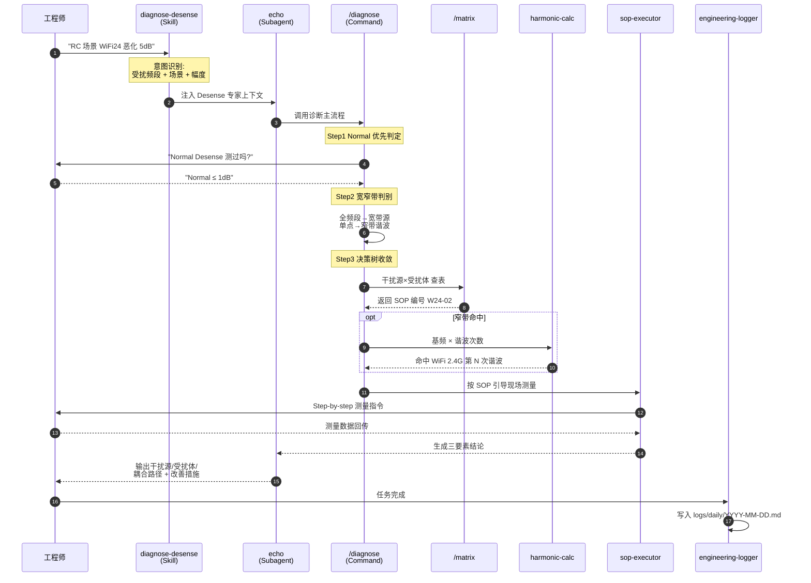

# Echo·Desense 架构与工作流

## 1. 系统架构：多 Agent 协作

```mermaid
flowchart TB
    User([工程师自然语言输入<br/>"RC 场景 WiFi 2.4G 灵敏度恶化 5dB"])

    subgraph Harness["Claude Code / Claude Agent SDK"]
        direction TB
        Skills["Skills (自动触发)"]
        Commands["Slash Commands (工作流)"]
        Subagent["Subagent (人格/上下文隔离)"]
    end

    subgraph SK["Skills 层"]
        DD[diagnose-desense<br/>意图识别]
        HC[harmonic-calc<br/>谐波命中计算]
        SE[sop-executor<br/>SOP 引导]
        EL[engineering-logger<br/>日志归档]
    end

    subgraph CMD["Commands 层"]
        Diag["/diagnose<br/>诊断主流程"]
        Mat["/matrix<br/>矩阵查表"]
        Form["/formal<br/>正式报告"]
        Play["/playground<br/>临时调试"]
    end

    subgraph AG["Subagent 层"]
        Echo["echo<br/>Desense 专家人格<br/>三要素 + 四原则"]
    end

    subgraph KB["知识库 (78 文档)"]
        Meth[methodology/<br/>方法论 4 篇]
        Mtx[matrix/<br/>矩阵 + YAML]
        SOPs[sops/<br/>41 个 SOP]
        Case[cases/<br/>历史案例]
    end

    subgraph Tools["Python / Shell 工具"]
        HCpy[harmonic_calc.py]
        LB[link_budget.py]
        Chk[check-architecture<br/>-consistency.py]
        Log[logger.py]
    end

    User --> DD
    DD --> Diag
    Diag --> Echo
    Echo --> Mat
    Mat --> SOPs
    Diag --> HC
    HC --> HCpy
    SOPs --> SE
    SE --> User
    User --> EL
    EL --> Log
    User --> Form
    Form --> Case
    Echo -.读.-> Meth
    Mat -.读.-> Mtx
```

## 2. 核心链路：一次 Desense 诊断的长链推理



## 3. 关键设计原则

| 层级 | 关注点 | 好处 |
|---|---|---|
| **Skill 层** | 自然语言意图识别、自动触发 | 用户零学习成本 |
| **Command 层** | 标准化工作流、可复用 | 流程一致、可审计 |
| **Subagent 层** | 人格与上下文隔离 | 长上下文不污染主会话 |
| **知识库** | 文档即配置 | 工程师可直接维护，无需改代码 |
| **Tools** | Python 脚本兜底计算 | 谐波命中、链路预算等精确运算 |

## 4. 项目数据

- Slash Commands: **4** (/diagnose /matrix /formal /playground)
- Skills: **4** (diagnose-desense / harmonic-calc / sop-executor / engineering-logger)
- Subagents: **1** (echo)
- 标准化 SOP: **41** (覆盖 W24/W5/GL1/GL5/LHB/LLB/Normal 六大频段族)
- 知识库文档: **78** 篇 / **17,444** 行
- 工具脚本: **12** 个 (Python + Shell)
- 已归档工作日志: **5** 篇 (daily/weekly)

## 5. 为什么选 Claude Agent SDK

1. **原生支持多 Agent 协作**：Subagent 机制天然契合"专家人格 + 工作流"解耦
2. **Skill 自动触发**：无需显式调用，工程师用自然语言就能进入标准流程
3. **文档即配置**：`.md` 即可定义 agent/command/skill，团队维护门槛极低
4. **长上下文 + 文件系统记忆**：17K+ 行知识库可随时索引，不受单次对话窗口限制
