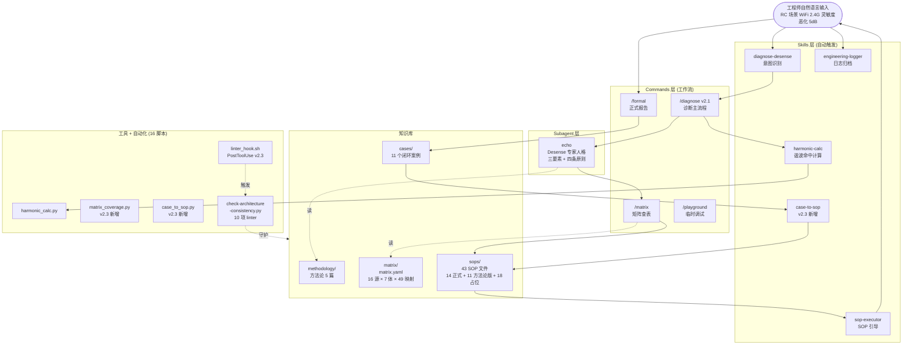
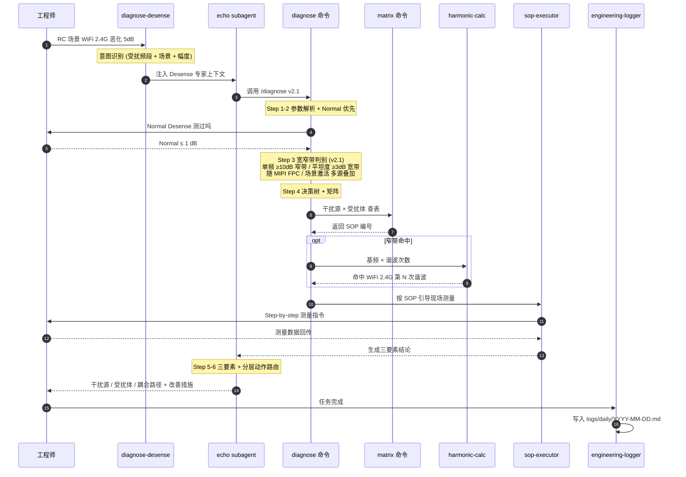

# Echo·Desense 架构与工作流

**当前版本**:v2.3.0(2026-05-06 Phase 3 Sprint 1 完成)

## 1. 系统架构:多 Agent 协作



## 2. 核心链路：一次 Desense 诊断的长链推理



## 3. 关键设计原则

| 层级 | 关注点 | 好处 |
|---|---|---|
| **Skill 层** | 自然语言意图识别、自动触发 | 用户零学习成本 |
| **Command 层** | 标准化工作流、可复用 | 流程一致、可审计 |
| **Subagent 层** | 人格与上下文隔离 | 长上下文不污染主会话 |
| **知识库** | 文档即配置 | 工程师可直接维护，无需改代码 |
| **Tools** | Python 脚本兜底计算 | 谐波命中、链路预算等精确运算 |

## 4. 项目数据(v2.3.0,2026-05-06 更新)

- Slash Commands: **4** (`/diagnose` v2.1 / `/matrix` / `/formal` / `/playground`)
- Skills: **5** (diagnose-desense / harmonic-calc / sop-executor / engineering-logger / **case-to-sop** v2.3)
- Subagents: **1** (echo,四条工作原则:Normal 优先 / 软件优先 / 设计查阅 / **宽窄带判别**)
- 方法论文档: **5** 篇(三要素 / Normal 优先 / 软件优先 / 设计查阅 / **宽窄带判别 v1.0**)
- 标准化 SOP: **43 文件 / 49 映射**(**14 正式 + 11 方法论版(v0.9)+ 18 占位**,覆盖 W24/W5/GL1/GL5/LHB/LLB/NORMAL 七大频段族)
  - Sprint 1(v2.1):LLB-07 / W24-03 / LHB-04 v0.9
  - Sprint 2(v2.2):W24-08 / W24-09 / W5-01 / LHB-01 / LHB-03 / LLB-03 / GL1-03 / GL1-04 v0.9
- 矩阵:**16 源 × 7 受扰体 × 49 映射**(单一真相源 `matrix.yaml` v2.1.0)
- 案例库:**11 个闭环案例**(AS2-RC / EMC-2024-triage / O11-DDR-LLB / O2-NFC-W24 + Sprint 2 拆出 7 个 EMC 案例)
- 方法论创新(v2.1 ~ v2.3):一案多 SOP 模式 / 步骤 2.6 多源叠加排查法 5 子节 / 双案例对比表 / GPS 特殊性专节(3 dB 即严重 + 3 周时间护栏)
- 自动化基建(v2.3):PostToolUse hook / case→SOP skill / 矩阵覆盖度报告 / **10 项** linter
- 工具脚本:**16** 个(Python + Shell,含 matrix 生成器 / SOP stub 生成器 / 一致性 linter / 覆盖度报告 / 案例→SOP 规划)
- Git:**4 个 tag**(`v2.0.0` Phase 1 / `v2.1.0` Sprint 1 / `v2.2.0` Sprint 2 / `v2.3.0` Phase 3 Sprint 1)
- 远端:GitHub `cuipointer/Echo`
- 治理指标:Linter 0/0 跨 4 tag / 知识漂移 0 次/月 / 案例孤儿 0

## 5. 为什么选 Claude Agent SDK

1. **原生支持多 Agent 协作**：Subagent 机制天然契合"专家人格 + 工作流"解耦
2. **Skill 自动触发**：无需显式调用，工程师用自然语言就能进入标准流程
3. **文档即配置**：`.md` 即可定义 agent/command/skill，团队维护门槛极低
4. **长上下文 + 文件系统记忆**：17K+ 行知识库可随时索引，不受单次对话窗口限制

## 6. 单一真相源架构(v2.1.0 固化)

Echo 的**核心设计决策**是为每一类知识建立**单一真相源**，所有视图文件由生成器/引用派生，消除漂移风险:

| 层 | 真相源 | 派生视图 |
|---|---|---|
| 诊断工作流 | [.claude/commands/diagnose.md](../../.claude/commands/diagnose.md) v2.1 | echo agent 引用、diagnose-desense skill 转交 |
| 矩阵 | [knowledge/matrix/matrix.yaml](../../knowledge/matrix/matrix.yaml) v2.1.0 | `matrix-table.md` / `source-list.md` / `victim-list.md`(由 `tools/gen_matrix_views.py` 生成) |
| 术语 | [knowledge/glossary.md](../../knowledge/glossary.md) | 各 SOP 附录引用 |
| 方法论 | [knowledge/methodology/](../../knowledge/methodology/) | `/diagnose` Step 3 引用 `bandwidth-discrimination.md`;echo agent 引用四原则文档 |
| 变更记录 | [CHANGELOG.md](../../CHANGELOG.md) | 各 SOP / 文件自带 `**版本**` 字段 |

守护由 [tools/check-architecture-consistency.py](../../tools/check-architecture-consistency.py) v2 执行(10 项自动检查，当前 0 错 0 警)。

## 7. Phase 2 Sprint 1 反哺路径(2026-05-06)

```
EMC 2024 案例分析(9 案例)  ──→  6 条架构建议
                               │
                ┌──────────────┼──────────────┐
                ▼              ▼              ▼
        matrix.yaml v2.1   bandwidth-       SOP 模板步骤 2.6
        +NFC 共存源        discrimination    多源叠加排查法
        +SHIELD→W24        .md v1.0
                │              │              │
                └──────────────┼──────────────┘
                               ▼
                       /diagnose v2.0 → v2.1
                       (Step 3 自动判据 + 反例提醒)
                               │
                               ▼
                       3 个 P0 SOP v0.9 方法论版
                       LLB-07 / W24-03 / LHB-04
```

详见 [CHANGELOG.md](../../CHANGELOG.md) v2.1.0 + [docs/phase2-sprint-plan.md](phase2-sprint-plan.md)。
